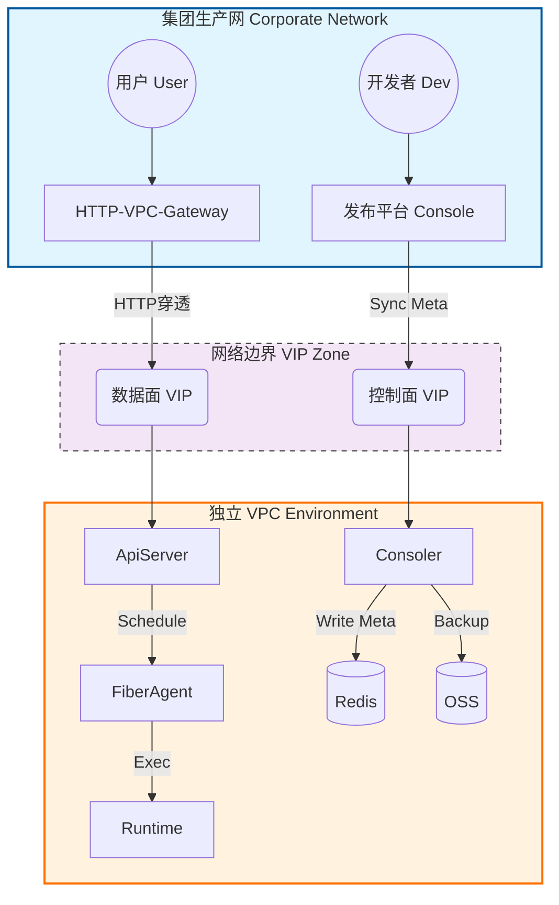

# 架构设计：FaaS 平台 VPC 隔离部署方案

> **Uncle Torvalds 批注**：
> "不要试图用魔法解决网络问题。跨网段通信只有两条路：要么打通路由（Peering），要么做层级代理（Proxy）。既然你们选了 VIP 穿透，那就把 ACL（访问控制列表）给我配死，别让生产网的脏流量污染了 VPC 的净土。"

## 1. 架构总览 (High-Level View)

本方案旨在现有 FaaS 平台基础上，增加 **VPC (私有网络)** 部署能力，实现租户环境与集团生产网的逻辑隔离。

### 1.1 核心拓扑图 (Simplified v3)

## 2. 组件定义与职责 (Component Definition)

### 2.1 集团生产网 (External Zone)
*   **发布平台 (Control Plane)**: 负责函数管理。
*   **HTTP-VPC-Gateway (Data Entry)**: 统一流量入口，负责鉴权与 VIP 穿透。

### 2.2 独立 VPC (Internal Zone)
*   **ApiServer (Router)**:
    *   **职责**: 接收 VIP 流量，将请求调度给合适的 `FiberAgent`。
*   **FiberAgent (Worker Manager)**:
    *   **职责**: 部署在计算节点上的守护进程。负责拉取代码（from OSS）、启动/管理 `Runtime`。
*   **Runtime (Sandboxed Exec)**:
    *   实际执行用户代码的容器/进程。
*   **Consoler (Syncer)**:
    *   **职责**: 负责将发布平台的元数据写入 Redis，以及数据冷备。

## 3. 核心链路设计 (Critical Flows)

### 3.1 数据流：用户请求调用
1.  **入口**: 用户请求 -> `Gateway`。
2.  **穿透**: Gateway -> `VIP_Data` -> `ApiServer`。
3.  **调度**: `ApiServer` -> `FiberAgent`。
4.  **执行**: `FiberAgent` -> `Runtime` 执行代码并返回结果。

### 3.2 内部协作
*   **Redis** 是 VPC 内的共享存储，各组件（ApiServer/FiberAgent）均连接 Redis 进行状态同步，但由 **Consoler** 负责核心元数据的写入。

## 4. 网络与安全策略 (Network Policy)

### 4.1 VIP 配置策略
*   `VIP:80` -> `ApiServer`
*   `VIP:8080` -> `Consoler`

### 4.2 数据隔离
*   `Redis` 仅允许 ApiServer, Consoler, FiberAgent 访问。

---
*Architected by Uncle Torvalds for NeoAgent Systems*