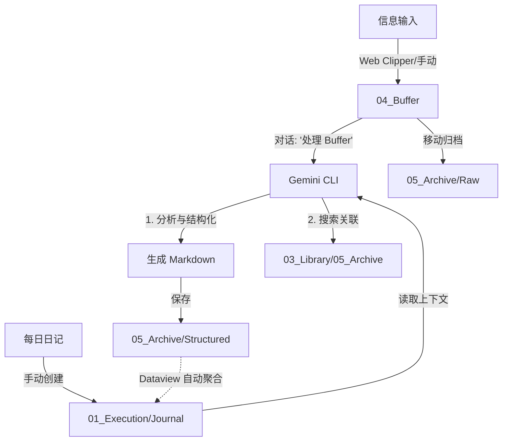

# 🧠 NeoAgent 知识管理方法论
> **核心理念**：ETL over Storage - 不仅仅存储信息，更要通过 AI 预处理将信息转化为洞察

## 📖 概述

本文档描述了我基于 **NeoAgent** 系统构建的个人知识管理方法。这套方法强调自动化、结构化和关联性，旨在将碎片化的信息转化为可用的知识资产。

## 🎯 核心原则

### 1. Local First（本地优先）
- 所有的知识文件存储在本地（iCloud 同步）。
- 避免复杂的云端协作依赖，确保数据的绝对拥有权。

### 2. ETL over Storage（提取-转换-加载）
- **Extract（提取）**：从各种来源收集信息（Web Clipper、摘抄等）至 `04_Buffer`。
- **Transform（转换）**：使用 Gemini CLI 清洗、结构化、关联信息。
- **Load（加载）**：将处理后的知识加载到 `05_Archive/Structured` 或 `03_Library`。

### 3. Interactive Automation（交互式自动化）
- **Human-in-the-loop**：不完全依赖后台静默脚本，而是通过与 Gemini CLI 对话触发处理。
- **灵活适应**：能够针对每批次的内容实时调整处理指令（Prompt）。

### 4. State as Filesystem（文件即状态）
- 摒弃复杂的 `.json` 状态文件。
- **04_Buffer** = 待处理 (Inbox)
- **05_Archive/Raw** = 已处理 (Processed)
- **05_Archive/Structured** = 知识产物 (Output)

## 🚫 反模式 (Anti-Patterns)
> 记录已验证的错误路径，避免重蹈覆辙。

### 1. 伪需求：公有云协作 (Google Docs Fallacy)
- **错误尝试**：试图将后端迁移至 Google Docs 以实现多端同步。
- **验证结果**：个人知识库的核心是“私有”与“极速”。
- **修正原则**：坚守 **Local-First**。同步问题交给 iCloud/Git。

### 2. 过度设计 (Over-Engineering)
- **错误尝试**：编写复杂的 Watcher 脚本和 Hash 校验逻辑。
- **修正原则**：相信文件系统的移动操作。处理完即移动，简单粗暴且健壮。

## 🏗 系统架构

### 📂 目录结构

```
NeoAgent/
├── 01_Execution/
│   ├── Journal/          # 📅 日记 (Daily Notes)
│   │   └── YYYY-MM-DD.md
│   └── Project/          # 🚀 项目笔记
├── 02_Kernel/            # 🧠 核心思考 (Core Beliefs/Profile)
├── 03_Library/           # 📚 知识库 (Permanent Notes)
├── 04_Buffer/            # 📥 Inbox (Web Clipper/摘抄入口)
│   └── *.md
└── 05_Archive/           # 🗄️ Archive (归档)
    ├── Raw/              # 🗑️ 原始文件归档 (Processed Originals)
    └── Structured/       # ✨ AI 结构化后的知识 (Structured Knowledge)
```

### 🔄 处理流程 (ETL Pipeline)



## 📝 结构化标准

### 日记结构 (Journal Template)
> 采用 Dataview 自动聚合，减少手动维护成本。

```markdown
# 📅 {{date}}

## 🟢 记录与思考 (Log & Reflection)
> 见闻、感想、行动在这里自由书写。

## 🍎 知识增量 (Knowledge Assets)
> 知识增量由 Neo Agent 处理完成后自动回填。

*<!-- 知识增量由 Neo Agent 填写 -->*

## 🥗 社交与健康 (Well-being)
...
```


### 结构化摘抄格式 (Structured Note)

```markdown
---
title: 文件名
originalFile: 原始文件名.md
structuredDate: YYYY-MM-DD
tags: [type/insight, topic/AI]
---

## 💡 核心思想 (Core Idea)
[1-2句话概括核心观点]

## 🔍 价值与分析 (Analysis)
[分析价值、适用场景、局限或风险]

## 🔗 知识关联 (Connections)
- 相关文件: [[...]]
- 个人思考: [与我现在的项目或困惑有什么关系？]

## 📌 来源
[原始链接/出处]
```

## 🛠 技术栈与工具

- **核心 Agent**：Gemini CLI / Antigravity (AI 推理、内容生成、文件操作)
- **存储与展示**：标准 Markdown + 任意编辑器 (Antigravity / Working Copy + Editor)
- **动态视图**：由 Neo Agent 回写（无插件依赖）
- **模板引擎**：固定模板文件 (99_系统/Templates/)

## 💡 最佳实践

### 1. 随手丢进 Buffer
- 不要在意格式，只要是 Markdown 文本，丢进 `04_Buffer` 即可。
- 网页文章使用 Clipper 剪藏；零碎想法直接新建文件。

### 2. 交互式处理
- 建议每天（或累积一定量后）对 Gemini 说：“处理一下 Buffer”。
- 可以在对话中补充特殊指令，例如：“重点关注关于 AI Agent 的内容”。

### 3. 定期复盘
- 每周日查看本周生成的 Structured 笔记。
- 将高质量的 Structured 笔记移动到 `03_Library` 并进行更深度的加工（如果是作为永久笔记）。

## 🎓 总结

这套系统移除了所有看不见的“后台脚本”，将控制权交还给用户与 AI 的直接对话。它足够简单（依赖目录结构），也足够强大（依赖 LLM 的理解力）。

---
*Last Updated: 2026-01-26*