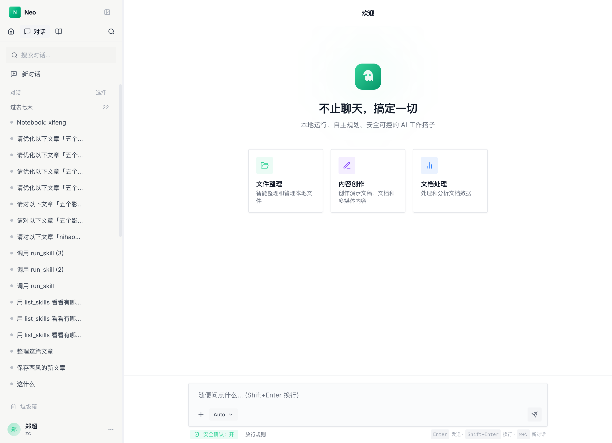

# Neo

[](https://github.com/zane-byte-dev/neo/actions/workflows/ci.yml)
[](LICENSE)
[](https://nodejs.org/)
[](https://www.typescriptlang.org/)

> 个人 AI 助手服务：Web Chat + Notebook 知识库 + 自动化运行 + 可扩展的 Tool/Skill 体系。
> 当前模型运行时基于 DeepSeek + Vercel AI SDK，自托管，单用户为先。

**English** · [Read in English →](README.en.md)



---

## 快速开始

```bash
git clone https://github.com/zane-byte-dev/neo.git
cd neo
npm install && npm run web:install

# 直接启动即可：首次运行会在 ~/.neo/config.json 自动生成默认用户
# （随机 webToken / SESSION_SECRET，工作目录默认在 ~/.neo/{workspace,state}/default）
# 启动后控制台会打印登录 webToken，复制到浏览器登录即可。
npm run dev:bot              # 后端 HTTP 服务，监听 :3000
npm run web:dev              # 另开终端，前端开发服务器 :5173
```

打开 http://localhost:5173，首次进入 **Settings / Basic / Overview** 查看系统状态；如果 Models 显示未就绪，配置 `DEEPSEEK_API_KEY` 后即可开始对话。空 Chat 欢迎页现在会显示“开始使用 Neo”清单，引导你完成模型配置、第一条消息和第一条 Notebook 笔记。生产部署见下文「生产部署」一节，常见问题见 [docs/user-guide/FAQ.md](docs/user-guide/FAQ.md)。如果你想在这个仓库里用 GitHub Copilot 跑一轮文档驱动的 AI 开发流程，直接看 [docs/user-guide/AI_DEVELOPMENT.md](docs/user-guide/AI_DEVELOPMENT.md)。

> 想贡献代码？请阅读 [CONTRIBUTING.md](CONTRIBUTING.md) 与 [CODE_OF_CONDUCT.md](CODE_OF_CONDUCT.md)。
> 发现安全问题？请走 [SECURITY.md](SECURITY.md) 中的私密披露流程，不要开公开 issue。

---

## 功能概览

| 模块 | 说明 |
|------|------|
| **AI 对话** | 基于 DeepSeek 的多轮对话，支持流式输出、函数调用、子 agent 派生和回复复制 |
| **Notebook** | 文章/知识条目管理，含全文搜索、文章批注和文章内资源预览 |
| **Skills** | Markdown 定义的可复用 AI 技能，支持参数插值与代码块执行 |
| **Tools** | 内置工具 + 用户自定义工具（`{stateDir}/tools/` 自动加载） |
| **自动化** | Webhook / Cron / Workflow 触发 Agent，支持串行步骤、运行历史和手动运行 |
| **Local AI Gateway** | OpenAI / Anthropic 兼容 `/v1` 本地入口，外部客户端可复用 Neo 的模型路由、密钥管理和 usage 记录 |
| **浏览器扩展** | Chrome 划词保存，支持 X.com 推文、Gemini 对话、飞书 Wiki |
| **Web UI** | React 前端，提供 Chat / Notebook 面板 |

---

## 技术栈

- **运行时**：Node.js ≥ 18 (ESM) + TypeScript
- **后端框架**：Koa 3 + better-sqlite3（知识索引）
- **LLM**：Vercel AI SDK + DeepSeek Anthropic-compatible API（流式 + 函数调用）
- **前端**：React 19 + Vite + Tailwind CSS 4
- **进程管理**：PM2

---

## 项目结构

```
neo/
├── packages/
│   ├── app/                # Koa HTTP 服务、CLI、路由和自动化入口
│   ├── agent/              # LLM、agent-runner、tools、skills、memory、notebook
│   └── runtime/            # run/event/checkpoint/pending action 运行时契约
├── web/                    # React 前端
│   └── src/
│       ├── components/     # Chat / Notebook 面板
│       ├── stores/         # Zustand 状态管理
│       └── api.ts          # 后端 API 客户端
├── extension/              # Chrome 浏览器扩展
├── logs/                   # 运行日志（JSONL 格式，按日切分）
└── ecosystem.config.cjs    # PM2 配置
```

---

### 前置条件

- Node.js ≥ 18
- npm ≥ 10
- DeepSeek API Key（`DEEPSEEK_API_KEY`）

### 安装依赖

```bash
# 根目录（后端）
npm install

# 前端
npm run web:install
```

### 配置：`~/.neo/config.json` 或 `packages/agent/src/config.local.ts`

首次启动时若两者都不存在，会在 `~/.neo/config.json` 自动生成单用户默认配置（随机 `webToken` / `SESSION_SECRET`，`workDir`/`stateDir` 落到 `~/.neo/{workspace,state}/default`），并把 webToken 打印到控制台。

如需自定义（多用户、自定义路径、托管在仓库内等），仍可手动复制模板，`config.local.ts` 优先级高于 `~/.neo/config.json`：

```bash
cp packages/agent/src/config.local.example.ts packages/agent/src/config.local.ts
```

```ts
// packages/agent/src/config.local.ts
import type { LocalConfig } from './config.js';

const config: LocalConfig = {
    USERS: [
        {
            id: 'alice',
            name: 'Alice',
            tenants: [],                     // 预留外部平台映射
            webToken: 'long-random-string',  // Web 登录 token
            gatewayToken: 'long-random-gateway-token', // 高级可选：静态 /v1 本地 AI Gateway token
            workDir:  '/abs/path/to/workspace',   // 个人工作区（AGENTS.md / notebooks / skills…）
            stateDir: '/abs/path/to/state',       // 运行态数据（runs / secrets / usage…）
        },
    ],
    SESSION_SECRET: 'change-me-to-a-long-random-string', // 用于签名 Cookie 与派生 secrets 加密密钥
};

export default config;
```

> ⚠️ **关于 API Key / Token**：当前模型运行时读取 `DEEPSEEK_API_KEY` 环境变量；用户级 Web token、Gateway token 与 Session secret 可放在 `~/.neo/config.json` 或 `config.local.ts` 中。不要把真实 secret 提交到仓库。

### 可选环境变量

大部分场景无需设置任何环境变量。以下仅在特殊需求时使用：

```bash
# Web 端口（默认 3000）
WEB_PORT=3000

# DeepSeek API Key
DEEPSEEK_API_KEY=sk-...

# 日志级别
LOG_LEVEL=info                  # debug | info | warn | error

# 每日付费 LLM 调用美元预算上限（0 = 不限）
DAILY_COST_LIMIT=0
```

### Local AI Gateway

在 **Settings / Basic / Models** 打开 **Local AI Gateway** 后，外部本地客户端可以把 Neo 当作统一模型入口。页面会生成 gateway token 并显示本机 Base URL：

```bash
OPENAI_BASE_URL=http://localhost:3000/v1
OPENAI_API_KEY=<neo-gateway-token>

ANTHROPIC_BASE_URL=http://localhost:3000/v1
ANTHROPIC_AUTH_TOKEN=<neo-gateway-token>
ANTHROPIC_MODEL=deepseek
```

首版支持 `GET /v1/models`、`POST /v1/chat/completions` 和 `POST /v1/messages`。Gateway 不注入 Web Chat 的系统提示、记忆或 Neo tools；Anthropic 工具调用只按协议透传给客户端。`gatewayToken` 配置字段仍可作为高级静态 token 回退。详细配置见 [docs/user-guide/LOCAL_AI_GATEWAY.md](docs/user-guide/LOCAL_AI_GATEWAY.md)。

### 开发模式

```bash
# 编译并启动后端 HTTP 服务
npm run dev:bot

# 启动前端开发服务器（另开终端）
npm run web:dev
```

前端默认运行在 `http://localhost:5173`，后端默认运行在 `http://localhost:3000`。

### 验证

```bash
npm run verify
```

该命令会依次运行 runtime、agent、app、web 的 TypeScript 检查，然后执行完整 Vitest 套件。只想快速跑类型检查时可用 `npm run typecheck`。

### 生产部署（Mac Mini / 长期运行）

生产环境只需运行一个进程。Koa 后端在同一端口（默认 3000）同时提供 API 和前端静态文件（`packages/web/dist/`），无需额外的静态服务器。

#### 首次部署

```bash
# 1. 安装全局工具（如果还没有）
npm install -g pm2

# 2. 安装依赖
npm install
npm run web:install

# 3. 一键构建并启动
npm run deploy
# 等价于: tsc + npm run web:build + pm2 start ecosystem.config.cjs

# 4. 设置开机自启
pm2 startup       # 按提示执行输出的 sudo 命令
pm2 save          # 保存当前进程列表
```

#### 后续更新

```bash
git pull
npm run deploy:restart
# 等价于: tsc + npm run web:build + pm2 restart neo-bot
```

#### 常用运维命令

```bash
npm run pm2:status   # 查看进程状态
npm run pm2:logs     # 实时日志（Ctrl+C 退出）
npm run pm2:restart  # 重启所有进程
npm run pm2:stop     # 停止所有进程
```

#### 域名 + HTTPS（可选，推荐 Caddy）

```bash
brew install caddy
```

`/etc/caddy/Caddyfile`：

```
your-domain.com {
    reverse_proxy localhost:3000
}
```

```bash
brew services start caddy
# Caddy 会自动申请并续期 Let's Encrypt 证书
```

#### 架构示意

```
[浏览器 / 外部 Webhook]
        │
  your-domain.com
        │  (Caddy HTTPS 反代，可选)
        ▼
  Koa Server :3000  ← PM2 守护
  ├── /api/*        → 路由处理（AI 对话 / Notebook / 文件上传…）
  └── /*            → packages/web/dist/ 静态文件
```

---

## API 路由

所有 API 路径以 `/api/` 为前缀，需携带有效 Session Cookie（`/api/auth/login` 除外）。

| 路由文件 | 路径前缀 | 说明 |
|----------|----------|------|
| `routes/chat.ts` | `/api/chat` | SSE 流式对话 |
| `routes/upload.ts` | `/api/upload` | 文件上传（PDF / Word / Excel / 图片等） |
| `routes/notebook.ts` | `/api/notebook` | 知识条目 CRUD |
| `routes/session.ts` | `/api/session` | 会话管理 |
| `routes/user.ts` | `/api/auth` | 登录/用户信息 |
| `routes/me.ts` | `/api/me` | 个人资料 |
| `routes/assets.ts` | `/api/assets` | 会话生成的静态资源（图片、视频） |
| `routes/reload.ts` | `/api/reload` | 热重载用户缓存（编辑 AGENTS.md 等后调用） |
| `routes/webhook.ts` | `/api/webhook/:userId` | 外部系统触发 Agent（需 webhookSecret） |
| `routes/cron.ts` | `/api/crons` | Cron 定时 Agent 任务管理 |
| `routes/mcp-config.ts` | `/api/mcp` | MCP Server 配置管理 |
| `routes/runs.ts` | `/api/runs` | 可恢复 Agent run 查询、事件追补与取消 |

---

## Tools（工具系统）

Neo 会自动向 Agent 注入内置工具，也会从 `{stateDir}/tools/` 加载用户自定义工具。完整参数、返回格式与开发示例见 [docs/user-guide/TOOLS.md](docs/user-guide/TOOLS.md)，沙箱执行见 [docs/user-guide/SANDBOX.md](docs/user-guide/SANDBOX.md)，MCP 扩展见 [docs/user-guide/MCP.md](docs/user-guide/MCP.md)。

### 内置工具速查（`src/tools/internal/`）

| 工具 | 说明 |
|------|------|
| `bash` / `read_file` / `write_file` / `list_dir` | 基础文件系统 + Shell 操作（`src/tools/executor.ts`） |
| `code_exec` | 沙箱执行代码，适合临时脚本、数据处理与安全隔离运行 |
| `edit_file` | 精确局部文件编辑 |
| `glob` | 按模式查找文件 |
| `grep` | 正则搜索文件内容 |
| `fetch_url` | 抓取网页内容 |
| `search_web` | 网络搜索 |
| `browser_command` | 操控真实浏览器（登录、点击、填表、截图、JS 执行） |
| `research` | 深度网络调研（自动搜索+阅读+综合报告） |
| `get_datetime` | 获取当前日期时间 |
| `get_weather` | 查询天气 |
| `notebook_search` | 在 Notebook 模式下检索当前来源并返回可引用段落 |
| `save_memory` | 保存长期记忆 |
| `update_now` | 更新当前关注点 / 近况记忆 |
| `todo` | 会话内任务跟踪 |
| `get_chat_history` | 查询历史对话记录 |
| `run_skill` / `list_skills` | 执行/列出已注册 Skill |
| `subagent` | 派生子 agent 执行独立子任务 |
| `ask_user` | 向用户提问确认 |
| `enter_plan_mode` / `exit_plan_mode` | 计划模式（限制写操作） |
| `generate_video` | 视频生成（Google Veo 3.1，4-8 秒短视频，需 GEMINI_API_KEY） |
| `update_user_profile` | 读取/更新用户档案 USER.md（记录长期偏好与背景信息） |

---

## 模型支持

当前代码路径保留了统一别名与路由边界，但实际模型工厂只创建 DeepSeek 的 Anthropic 兼容模型：

| 别名 | 实际模型 | 提供商 | 说明 |
|------|---------|--------|------|
| `deepseek` | deepseek-chat | DeepSeek API | 成本低，工具调用可靠 |
| `deepseek-reasoner` | deepseek-reasoner | DeepSeek API | 深度推理 |

`auto` 会解析为 `deepseek`；如果要恢复更多 provider，需要扩展 `packages/agent/src/llm/model-factory.ts` 和 `packages/agent/src/config.ts` 中的 `MODEL_ALIASES`。

---

## Skills（技能系统）

技能以 Markdown 文件形式定义，存放于 `{stateDir}/skills/` 目录。支持 YAML frontmatter 声明参数，正文作为 AI 系统指令，可通过 `{{param_name}}` 语法注入参数；也支持标记为 `execute` 的 JS / Python / Bash 代码块。完整格式见 [docs/user-guide/SKILLS.md](docs/user-guide/SKILLS.md)，最小示例见 [examples/skills/](examples/skills)。

Notebook 知识库、Webhook/Cron 自动化和可恢复 Agent 运行时分别见 [docs/user-guide/NOTEBOOK.md](docs/user-guide/NOTEBOOK.md)、[docs/user-guide/AUTOMATION.md](docs/user-guide/AUTOMATION.md)、[docs/user-guide/AGENT_RUNTIME.md](docs/user-guide/AGENT_RUNTIME.md)。

内置 Skills：`brief`、`summarize_text`、`generate_daily_log`、`generate_weekly_report`、`generate_wechat_article`、`js_snippet_runner`、`xifeng`（决策审计）

---

## 用户与工作区

用户信息定义在 `packages/agent/src/config.local.ts` 的 `USERS` 数组中，每个用户拥有两个独立目录：

- **`workDir`**：个人工作区，存放你自己的内容与配置（AGENTS.md / SOUL.md / notebooks…）。
- **`stateDir`**：运行态数据目录，由 Neo 自动维护（runs / secrets / usage / projects / skills / tools…）。

```
<workDir>/                 # 你维护，可以用 git 管理
├── AGENTS.md           # 任务路由与工具调用规则
├── SOUL.md             # 身份与沟通风格
├── TOOLS.md            # 工具使用指引
├── USER.md             # 用户基本信息与偏好
└── notebooks/          # 知识库 Markdown 文件

<stateDir>/                # Neo 自动维护，勿手改
├── secrets.json.enc    # AES-256-GCM 加密的 API Key
├── runs/               # 可恢复 Agent run 事件流
├── projects/           # 会话文件与运行产物
├── memory/             # episodic / semantic memory
├── notebooks/          # 知识索引 SQLite (FTS5)
├── skills/             # 用户自定义 Skill
├── tools/              # 用户自定义工具（tool.yaml + run.py）
├── routing.json        # Models 页保存的路由覆盖
├── tool-approvals.json # 危险工具放行规则（bash 的 session/always 按工具级生效）
└── usage.jsonl         # 按日调用量与成本记录
```

> 💡 仓库内已附最小可运行的 [examples/workspace/](examples/workspace) 模板（AGENTS.md / SOUL.md / USER.md / TOOLS.md）。复制到你的 `workDir` 即可作为起点。

**外部触发** 可通过 Webhook、Cron 和 Workflow 使用同一套 Agent Runtime：

- Webhook：`POST /api/webhook/:userId`，使用用户级 `webhookSecret` 认证。
- Cron：从 `{stateDir}/memory/schedule.json` 读取定时任务。
- Workflow：通过 `/api/workflows` 管理串行步骤、运行历史和手动运行。

---

## 核心架构

```
用户消息 → [HTTP SSE / CLI / Webhook / Cron / Workflow]
              ↓
         agent-runner.ts（共享一轮对话逻辑）
              ↓
    calcUser → session → run(event log) → history → LLM streaming → save
              ↓
       LLM Client (AI SDK + DeepSeek)
              ↓
      Tool calls → executor.ts → internal tools / user tools
                                → subagent（递归调用）
```

- `packages/agent/src/services/agent-runner.ts`：封装完整的「一次对话轮次」生命周期，HTTP、CLI 与自动化入口共用
- `packages/runtime/src/`：保存 run 元数据、事件流、checkpoint、pending action 和 artifacts，支持断线追补与工具确认后恢复
- `packages/app/src/routes/chat.ts`：SSE 流式推送，通过 run event bridge 接收文本、工具、artifact 与 todo 事件

---

## 浏览器扩展

`extension/` 目录包含一个 Chrome 扩展，支持：

- 划词选中后一键保存到 Inbox
- 保存 X.com 推文（含线程）
- 保存 Gemini 对话（保留代码格式）
- 保存飞书 Wiki 文档

**安装方式**：进入 `chrome://extensions/` → 开启开发者模式 → 加载已解压扩展程序，选择 `extension/` 目录。当前扩展保存到 `Downloads/neo/inbox/`，详细说明见 [docs/user-guide/BROWSER_EXTENSION.md](docs/user-guide/BROWSER_EXTENSION.md)。

---

## 更多文档

- [docs/README.md](docs/README.md)：文档索引
- [docs/user-guide/AI_DEVELOPMENT.md](docs/user-guide/AI_DEVELOPMENT.md)：如何用 GitHub Copilot 跑 Product Brief → Dev Plan → Implementation → Test Review → Closeout
- [docs/user-guide/FAQ.md](docs/user-guide/FAQ.md)：常见问题
- [CHANGELOG.md](CHANGELOG.md)：版本变更记录

---

## 许可证

MIT
