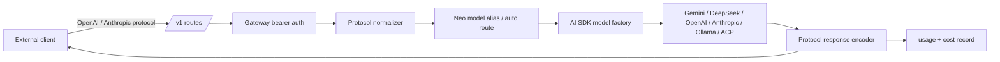

# Local AI Gateway Dev Plan

## Scope

实现个人本地 AI gateway MVP，目标是让外部本地客户端通过 OpenAI 或 Anthropic 兼容协议调用 Neo 已配置的模型能力。

首版范围：

- 新增 `/v1/models`、`/v1/chat/completions`、`/v1/messages`。
- 新增 gateway Bearer token 鉴权，不复用 Web cookie。
- 复用现有模型 alias、provider key、provider 状态、fallback 和 usage/cost 记录。
- OpenAI Chat Completions 支持文本消息、非流式和流式。
- Anthropic Messages 支持文本消息、非流式和流式，并为 Claude Code 保留 tool use 协议回合。
- Gateway 请求不注入 Neo Web Chat 的系统提示、记忆、Neo tools 或 Agent Runtime。

不在首版实现：

- 多租户网关控制台。
- 企业限流 / 配额 / 审计。
- semantic cache、guardrails、load balancing。
- 图片、音频、batch、embeddings、responses API。
- OpenAI function calling 与 Anthropic tools 的跨协议双向完整转换；首版只保证同协议客户端的声明和结果能走通。

## Current System

- `src/llm/client.ts` 当前把模型创建、prompt 构造、Neo tools、streaming、fallback、usage 记录耦合在一个 Chat/Agent 客户端里。
- `src/config.ts` 已定义 `MODEL_ALIASES`、provider key accessor、`OLLAMA_BASE_URL`、`GEMINI_CLI_PATH` 等模型基础配置。
- `src/llm/model-router.ts` 已能判断 alias 是否可用，并支持 `auto` 路由。
- `src/routes/model.ts` 已能返回模型列表、providerStatus、routing、usage、history。
- `src/server.ts` 当前认证中间件只保护 `/api/*` 和 `/apps/*`，新增 `/v1/*` 时必须显式保护。

关键拆分点：现有 `LLMClient.chatWithContextStreaming()` 适合 Neo Chat，不适合直接作为 gateway，因为它会构造 runtime prompt、注入 memory 和 Neo tools。Gateway 需要更低层的“模型调用 + 协议转换”路径。

## Architecture



设计原则：

- Route 层只处理 HTTP、认证、状态码和 streaming header。
- Service 层处理请求归一化、模型选择、fallback、usage 记录。
- Protocol adapter 只做 OpenAI / Anthropic request-response 格式转换。
- Model factory 只负责根据 Neo model id 创建 AI SDK `LanguageModel`。
- Gateway 不访问 Neo tool registry，不执行客户端工具。

## Backend Changes

### 1. Extract Model Factory

新增：`src/llm/model-factory.ts`

职责：

- 从 `src/llm/client.ts` 抽出 `resolveModel()`、provider 判断函数和 `createModel()`。
- 导出 `createLanguageModel(modelId: string)` 给 Chat 与 Gateway 共用。
- 保持 Claude Code compatible upstream 的现有逻辑：`claude-code/*` 仍走 Anthropic-compatible provider。

调整：

- `src/llm/client.ts` 改为调用 `createLanguageModel()`。
- 保持现有 `resolveModel()` public API，避免当前测试和调用方大面积改动。

验证：

- 扩展 `src/llm/__tests__/client.test.ts` 或新增 `model-factory.test.ts` 覆盖 alias resolution。

### 2. Add Gateway Auth

新增配置：

- `ConfigUser.gatewayToken?: string`

规则：

- Gateway token 是本地客户端访问令牌，配置在 gitignored 的 `src/config.local.ts` 或 home config 中。
- 未配置任何用户的 `gatewayToken` 时，`/v1/*` 视为未启用。
- `Authorization: Bearer <token>` 必须匹配某个用户的 `gatewayToken`。
- 鉴权成功后设置 `ctx.state.userId`，后续 usage/cost 归属该用户。
- 不复用 signed cookie；不要求浏览器登录。

调整：

- `src/config.ts` 的 `ConfigUser` 增加可选字段。
- `src/server.ts` 的 auth middleware 对 `/v1/` 单独走 gateway bearer auth。
- token 比较使用 timing-safe compare。

错误：

- 未启用：`403 gateway_disabled`
- 无 token：`401 missing_gateway_token`
- token 错误：`401 invalid_gateway_token`

### 3. Add Gateway Route

新增：`src/routes/ai-gateway.ts`

路由：

- `GET /v1/models`
- `POST /v1/chat/completions`
- `POST /v1/messages`

要求：

- 使用现有 auto route registry 自动加载。
- streaming 响应设置正确 SSE header。
- route 层不直接拼 provider 请求，只调用 gateway service。
- body parser 当前已启用，首版请求体限制沿用现有 `20mb`；后续可单独收紧。

### 4. Add Gateway Service

新增：`src/services/ai-gateway-service.ts`

职责：

- 根据 `ctx.state.userId` 解析用户 `stateDir` / `workDir`。
- 解析模型名：`auto` 走 `resolveSmartRoute()`；alias 走 `resolveModel()`；canonical id 原样尝试。
- 选择 fallback 策略：
  - `model=auto`：允许使用 routing fallback chain。
  - alias 指向 tier 内模型：默认只用 alias 对应模型，除非请求 header `x-neo-allow-fallback: true`。
  - canonical model id：默认不 fallback。
- 调用 AI SDK `streamText()` / `generateText()`。
- 记录 usage：`caller` 使用 `ai-gateway:openai` 或 `ai-gateway:anthropic`。
- 对上游错误做稳定错误映射。

不要做：

- 不调用 `buildTenantSystemInstruction()`。
- 不调用 memory recall。
- 不调用 `buildAiTools()` 或 Neo tool registry。
- 不写 chat session。

### 5. OpenAI Protocol Adapter

新增：`src/llm/gateway/openai.ts`

输入支持：

- `model: string`
- `messages: Array<{ role: 'system' | 'user' | 'assistant' | 'tool'; content: string | Array<...> }>`
- `stream?: boolean`
- `temperature?`
- `max_tokens?`
- `top_p?`

首版限制：

- 文本内容优先；非文本 part 返回 `400 unsupported_content_part`。
- OpenAI `tools` / `tool_choice` 可先返回 `400 unsupported_tools`，除非与 AI SDK declaration-only tool path 一起实现。

输出：

- 非流式：OpenAI Chat Completions shape。
- 流式：`data: { choices: [{ delta: { content } }] }`，结束发送 `data: [DONE]`。
- 错误：OpenAI style `{ error: { message, type, code } }`。

### 6. Anthropic Protocol Adapter

新增：`src/llm/gateway/anthropic.ts`

输入支持：

- `model: string`
- `system?: string | Array<...>`
- `messages: Array<{ role: 'user' | 'assistant'; content: string | Array<...> }>`
- `tools?: Array<{ name, description?, input_schema }>`
- `stream?: boolean`
- `max_tokens?`
- `temperature?`

Claude Code 关键路径：

- 将 Anthropic `tools` 转为 AI SDK declaration-only tools。
- 模型产生 tool call 时，编码为 Anthropic `tool_use` content block。
- 客户端下一轮传入 `tool_result` 时，转换为模型可理解的 tool result message。
- Neo 不执行 tool，也不记录工具审批。

输出：

- 非流式：Anthropic Messages shape：`{ id, type: 'message', role: 'assistant', content, model, stop_reason, usage }`。
- 流式：Anthropic event stream：`message_start`、`content_block_start`、`content_block_delta`、`content_block_stop`、`message_delta`、`message_stop`。
- 错误：Anthropic style `{ type: 'error', error: { type, message } }`。

验收重点：Anthropic streaming 格式要用 fixtures 锁住，不靠手工拼字符串。

### 7. Provider And Model Listing

`GET /v1/models` 返回 OpenAI-compatible model list：

- 返回 `auto`、当前 configured 的 Neo aliases，以及对应 canonical provider model id，避免外部客户端只识别 provider model id 时把列表过滤为空。
- 每项至少包含 `id`、`object: 'model'`、`created`、`owned_by`。
- 可选扩展字段放在 `metadata` 或 `x_neo` 下，避免破坏兼容客户端。

模型 id 策略：

- 外部推荐使用 Neo alias：`auto`、`flash`、`deepseek`、`claude`、`gemma`。
- Gateway 仍接受 canonical provider id，并在 `/v1/models` 中同时展示，方便有严格 model discovery 的客户端使用。

## Documentation Updates

- `docs/features/local-ai-gateway/brief.md`：产品边界、用户场景、成功标准。
- `docs/features/local-ai-gateway/plan.md`：实现计划、接口、测试策略。
- `docs/README.md`：功能文档索引加入 Local AI Gateway。
- 实现后补：`docs/user-guide/LOCAL_AI_GATEWAY.md`，包含 OpenAI SDK、curl、Claude Code 配置示例。
- 实现后补：`docs/features/local-ai-gateway/test-report.md`，记录自动化验证与 Claude Code smoke test。

## Testing Plan

### Unit Tests

- Gateway auth：无 token、错 token、匹配用户 token、未启用。
- OpenAI normalizer：system/user/assistant 文本消息、非法 content part、stream flag。
- OpenAI encoder：非流式 response shape、SSE chunk、`[DONE]`。
- Anthropic normalizer：system、text content、tool_use、tool_result。
- Anthropic encoder：message events、text delta、tool_use delta、error event。
- Model selection：`auto`、alias、canonical id、fallback allowed / disallowed。

### Route Tests

- `GET /v1/models` 需要 Bearer token。
- `GET /v1/models` 返回 auto、configured aliases 与对应 provider model id。
- `POST /v1/chat/completions` 非流式返回 OpenAI shape。
- `POST /v1/chat/completions` 流式返回 SSE header 和 `[DONE]`。
- `POST /v1/messages` 非流式返回 Anthropic shape。
- `POST /v1/messages` 流式返回 Anthropic event stream。

Route tests 应 mock gateway service 或 mock AI SDK model，避免真实 provider 调用。

### Build And Docs

- `npm run build`
- `npx vitest run src/routes/__tests__/ai-gateway.test.ts src/llm/gateway/__tests__/*.test.ts`
- `npm run docs:check`

### Manual Smoke

OpenAI-compatible curl：

```bash
curl http://localhost:3000/v1/chat/completions \
  -H "Authorization: Bearer $NEO_GATEWAY_TOKEN" \
  -H "Content-Type: application/json" \
  -d '{"model":"auto","messages":[{"role":"user","content":"Say hello in one sentence."}]}'
```

OpenAI-compatible streaming：

```bash
curl -N http://localhost:3000/v1/chat/completions \
  -H "Authorization: Bearer $NEO_GATEWAY_TOKEN" \
  -H "Content-Type: application/json" \
  -d '{"model":"flash","stream":true,"messages":[{"role":"user","content":"Count to three."}]}'
```

Claude Code smoke：

- 使用当前本机 Claude Code 版本确认自定义 Anthropic endpoint 变量名。
- 配置 base URL 指向 `http://localhost:3000/v1`。
- 运行一个只问答的 prompt。
- 运行一个会触发 Claude Code 自有工具的 prompt，确认 Neo 只转发 tool_use / tool_result，不执行 Neo tools。

## Implementation Phases

### Phase 0: Documentation

- 落地本 brief 和 dev plan。
- 更新 docs 索引。
- 跑 `npm run docs:check`。

### Phase 1: OpenAI-Compatible MVP

- 抽出 model factory。
- 增加 gateway token auth。
- 实现 `/v1/models`。
- 实现 `/v1/chat/completions` 非流式和流式文本。
- 记录 usage/cost。
- 补单测和 route test。

### Phase 2: Anthropic / Claude Code MVP

- 实现 `/v1/messages` 非流式和流式文本。
- 增加 Anthropic tools declaration / tool_use / tool_result 转换。
- 用 fixtures 锁定 event stream。
- 做 Claude Code smoke test 并记录实际配置变量。

### Phase 3: Product Polish

- [x] Models 页面显示 gateway enabled 状态。
- [x] 增加 token 生成 / 重置入口，token 只显示一次。
- 使用记录增加 gateway protocol filter。
- [x] 用户指南补完整配置示例和排错表。

## Acceptance Checklist

- [x] Gateway 未配置 token 时不可访问 `/v1/*`。
- [x] Bearer token 能映射到正确 Neo user。
- [x] `/v1/models` 返回 configured aliases。
- [x] OpenAI non-streaming 请求可返回完整回答。
- [x] OpenAI streaming 请求输出 OpenAI-compatible SSE。
- [x] Anthropic non-streaming 请求可返回完整回答。
- [x] Anthropic streaming 请求输出 Anthropic event stream。
- [x] Claude Code tool_use / tool_result 回合不触发 Neo tool executor。
- [x] Gateway 调用写入 usage/cost 记录。
- [x] 文档、构建和相关测试通过。

补充：真实 OpenAI SDK / Claude Code 客户端 smoke 尚需在配置有效 provider key 和 gateway token 的本机环境中执行，结果记录见 [test-report.md](test-report.md)。

## Deferred

- Responses API。
- Embeddings API。
- Image / audio / multimodal gateway。
- 完整 OpenAI tools/function-calling 兼容。
- 多用户 gateway token UI 和 per-client token 管理。
- 限流、配额、审计和 IP allowlist。
- Semantic cache 和 guardrails。
